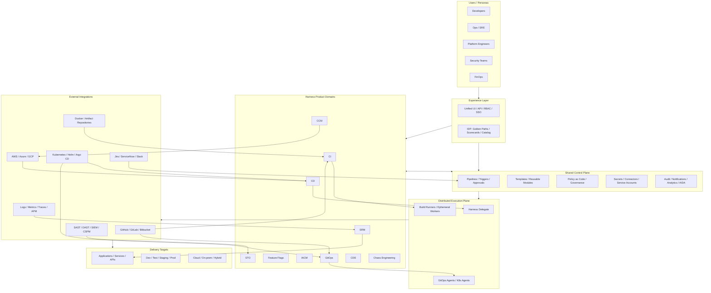

# Harness Technical Framework

This diagram shows Harness as a layered platform with a central control plane, a distributed execution plane, and integrations across the software delivery lifecycle.

## Suggested interpretation

- Experience layer: one entry point for developers, platform teams, security teams, and FinOps.
- Product domains: Harness capabilities are organized around CI/CD, GitOps, security, reliability, and cost.
- Shared control plane: governance, pipelines, templates, connectors, and analytics are reused across products.
- Execution plane: Delegates, runners, and agents execute work close to customer infrastructure.
- Integrations and targets: Harness connects upstream tools and deploys or evaluates downstream runtime environments.

## Presentation version

If you need a simplified executive view, you can collapse the diagram into four blocks:

1. Developer portal and governance
2. Delivery and operations products
3. Control plane plus execution plane
4. Enterprise integrations and runtime targets
