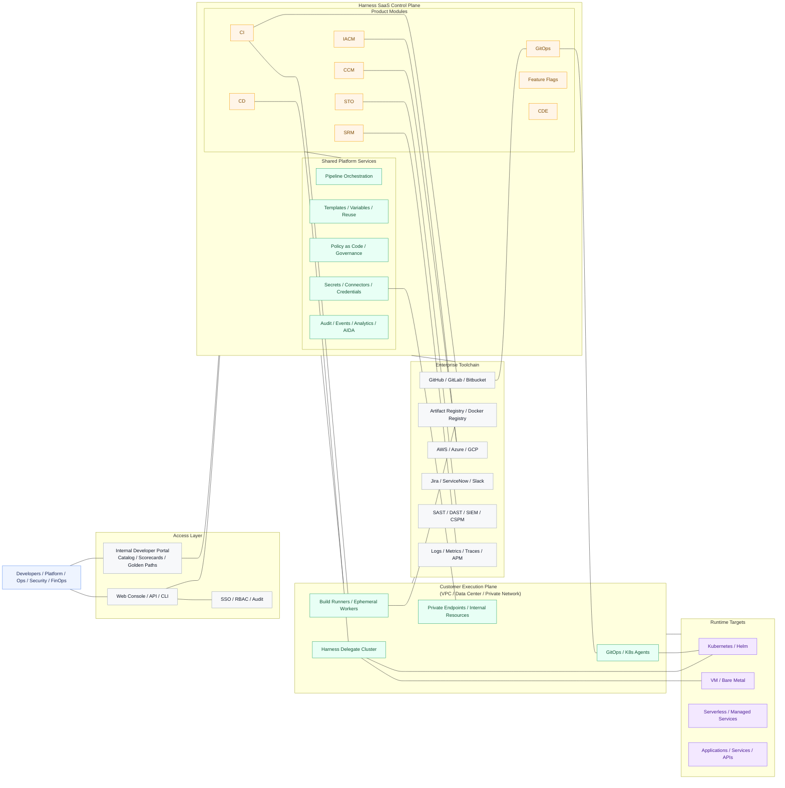

# Harness Technical Architecture

This version is a static architecture view rather than a process flow. It highlights the main deployment boundaries of Harness: access layer, SaaS control plane, customer-side execution plane, enterprise toolchain, and runtime targets.

## How to read this architecture

- Access layer: users interact through the Harness console, API, CLI, and IDP capabilities.
- SaaS control plane: Harness hosts orchestration, governance, analytics, and product logic here.
- Customer execution plane: sensitive execution stays close to enterprise infrastructure through Delegates, runners, and agents.
- Enterprise toolchain: Harness integrates with source control, cloud, security, ITSM, and observability systems.
- Runtime targets: applications are built, deployed, validated, and operated on Kubernetes, VMs, or managed cloud services.

## Executive simplification

For a PPT-style summary, you can present Harness as five static blocks:

1. User access layer
2. Harness SaaS control plane
3. Product modules
4. Customer-side execution plane
5. Enterprise integrations and runtime environment
